 

## Featured Projects

| Project | What it does | Stack | |
|---|---|---|---|
| 🛡️ **Aegis Intelligence** | Cybersecurity threat intelligence platform with a live recon-stream landing experience | React · FastAPI · OSINT tooling | private |
| 🌸 **[BloomGuard](https://github.com/zkkhan01/BloomGuard)** | Maternal health AI: risk scoring, symptom tracking, real-time clinician dashboard | FastAPI · Pathway · Next.js · TS · Docker | [repo](https://github.com/zkkhan01/BloomGuard) |
| 💼 **[FinSight](https://github.com/zkkhan01/FinSight)** | Financial document intelligence: extraction, KYC/AML rule engine, LLM explanations | LandingAI ADE · AWS Bedrock · React | [repo](https://github.com/zkkhan01/FinSight) |
| 🧠 **[RelapseRadar](https://github.com/zkkhan01/relapseradar)** | Streaming relapse prevention: live risk scores from wearable + self-reported data | Pathway · Python · FastAPI | [repo](https://github.com/zkkhan01/relapseradar) |
| 🔧 **Fixr** | IT support portal for Premier Early Childhood Education: dashboards, admin panel, live chat | React · Firebase · AI chat | client |
| 📆 **[Scheduling Platform](https://github.com/zkkhan01/dpu-athletics)** | Cross-platform team scheduling: shift swaps, RBAC, shared web/mobile backend | Flask · React · React Native · Firebase | [repo](https://github.com/zkkhan01/dpu-athletics) |
| 🧪 **[Grading Engine](https://github.com/zkkhan01/grading)** | Hybrid Java/Python autograder: compilation, sandboxed test harness, batch reports | Java · Python | [repo](https://github.com/zkkhan01/grading) |

**Client work** · [premierearlychildhood.com](https://premierearlychildhood.com) · [courtsideconsulting.org](https://courtsideconsulting.org) · [pjjf.org](https://pjjf.org)

## Stats

## Certifications

`Certified Ethical Hacker` `Microsoft Security Essentials` `AWS Security Fundamentals` `Career Essentials in Cybersecurity` `Java Foundations (JetBrains)` `React Essential Training` `+ 40 more`

