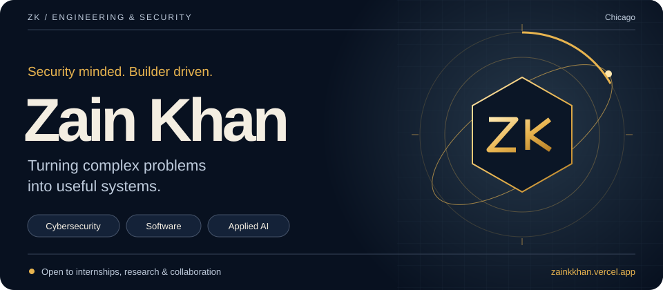
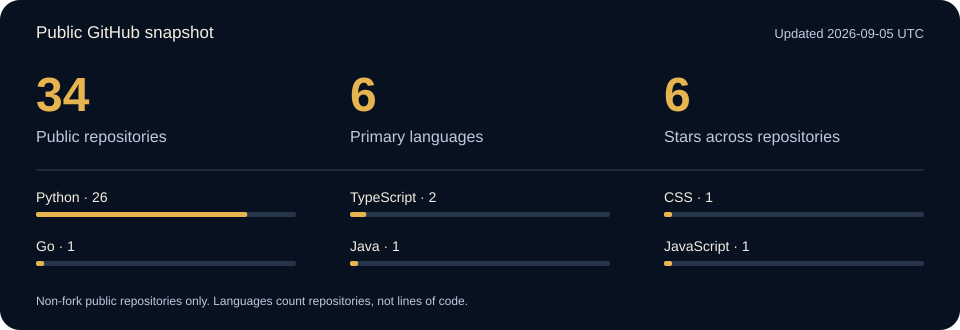

  

# Zain Khan

**I build software with a security mindset, from threat intelligence to applied AI systems.**

Based in Chicago, studying cybersecurity at DePaul University with a computer science minor. My work spans Python APIs, React interfaces, security tooling, and applied AI. I’m interested in internships, research, and collaborations across security and software engineering.

[Portfolio](https://zainkkhan.vercel.app) · [LinkedIn](https://www.linkedin.com/in/zainkhalilkhan/) · [Email](mailto:zainkhalilkhan1@gmail.com)

## Featured Projects

Ten selected builds, in the order featured on my [portfolio](https://zainkkhan.vercel.app). Each project title opens its overview and available demo.

| Project | What I’m building |
| --- | --- |
| **[Aegis Intelligence](https://zainkkhan.vercel.app/projects/aegis-intelligence)** | A reconnaissance assistant that turns Nmap and Gobuster output into structured findings, adds OSINT context, and maps potential attack paths. |
| **[Aegis SOC Analyst](https://zainkkhan.vercel.app/projects/aegis-soc-analyst)** | A security operations platform for normalizing telemetry, correlating MITRE ATT&CK detections, scoring incidents, and investigating events with a threat-hunting console. |
| **[Xternal](https://zainkkhan.vercel.app/projects/xternal)** | AI agents and workflow automation for operations, education, marketing, and internal service desks. |
| **[Flight Tracker](https://zainkkhan.vercel.app/projects/flight-tracker)** | Flight intelligence combining natural-language search, multiple telemetry sources, map tracking, flight-phase classification, and airport boards. |
| **[FinSight](https://zainkkhan.vercel.app/projects/finsight)** | Financial document intelligence with evidence extraction, KYC/AML validation, and credit-card comparison workflows. [Public repository](https://github.com/zkkhan01/FinSight). |
| **[Khan OS](https://zainkkhan.vercel.app/projects/khan-os)** | A personal AI workspace with multimodal conversation, local utilities, reminders, and agent planning with explicit tool permissions and approvals. |
| **[Fixr](https://zainkkhan.vercel.app/projects/fixr)** | Hardware troubleshooting through text, images, and camera input, with guided repair steps. |
| **[Airport Operations Simulator](https://zainkkhan.vercel.app/projects/airport-operations-simulator)** | An airport simulation for exploring aircraft movements, gate allocation, congestion, and responses to operational disruptions. |
| **[Travel Intelligence](https://zainkkhan.vercel.app/projects/travel-intelligence)** | A travel-planning experience bringing destination research, flights, ground transportation, and itinerary recommendations together. |
| **[Employee Scheduling & Team Management](https://zainkkhan.vercel.app/projects/employee-management)** | Web and mobile scheduling with shift swaps, real-time updates, and role-based access, built with Flask, React, React Native, and Firebase. |

**More public code:** [InterviewIQ / Prepti](https://github.com/zkkhan01/InterviewIQ), AI interview practice built with Shanzay Khan for HackIllinois; [BloomGuard](https://github.com/zkkhan01/BloomGuard), a maternal health workflow prototype; [RelapseRadar](https://github.com/zkkhan01/relapseradar), a streaming risk-scoring demo.

## Client & Portfolio Work

Beyond public repositories, I build websites and tools for education, consulting, and nonprofit organizations.

## Technical Focus

| Area | Tools and interests |
| --- | --- |
| Security | TLS, identity and access control, secure coding, threat intelligence |
| Software | Python, TypeScript, JavaScript, React, Next.js, FastAPI, Flask |
| AI & data | Gemini API, document extraction, Pathway, rule-based validation |
| Cloud & delivery | AWS, Firebase, Docker, Git |

## Certifications & Continuing Education

Selected professional certificates and coursework:

- **Microsoft Security Essentials Professional Certificate** · Microsoft
- **Career Essentials in Cybersecurity** · Microsoft and LinkedIn
- **AWS Administration: Security Fundamentals** · LinkedIn Learning
- **Java Foundations Professional Certificate** · JetBrains
- **React Essential Training** · LinkedIn Learning

[View the full credential and coursework catalog](https://zainkkhan.vercel.app/certifications).

## GitHub Activity

[Recent repositories](https://github.com/zkkhan01?tab=repositories&sort=updated) · [Contribution history](https://github.com/zkkhan01?tab=overview)

The card is stored in this repository and refreshed daily by GitHub Actions. Counts cover public, non-fork repositories; language counts describe repositories, not proficiency. The date shows the last successful refresh.

## Let’s Connect

For security and software engineering internships, research, or project collaborations:

**[zainkhalilkhan1@gmail.com](mailto:zainkhalilkhan1@gmail.com)** · [LinkedIn](https://www.linkedin.com/in/zainkhalilkhan/) · [Portfolio](https://zainkkhan.vercel.app)
